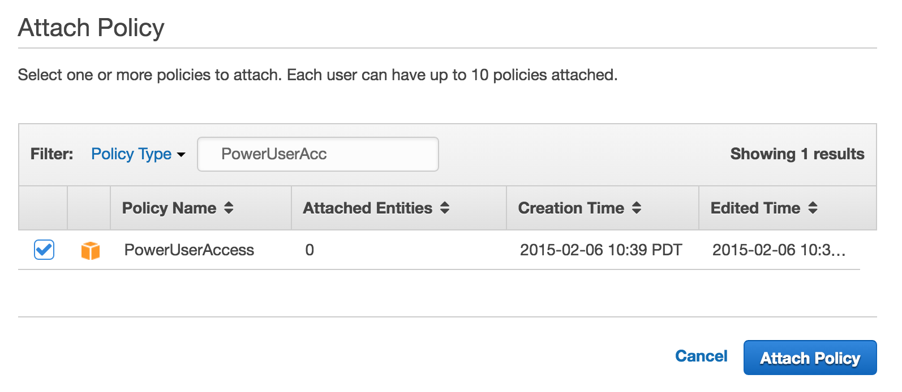

# Simple Beer Service Developer Bootcamp

Welcome to the Simple Beer Service developer bootcamp! I am excited to onboard *you* as a new SBS developer. That's right, after today - you are a part of the team. You will learn:

- How to collaborate on a serverless project.
- How to build a static Amazon S3 website, fronted by Amazon CloudFront.
- How to leverage AWS IoT to connect a device to the cloud.
- How to collect and stream data into downstream AWS services.

## Getting your environment setup.

### Prerequisites

You will need the following tools to get started today.

1. An AWS account, of course! [Create one today!](https://aws.amazon.com/getting-started/)
2. A GitHub account. Need one? [Create one today!](https://github.com/join)
3. The version control system Git. [Install here.](https://git-scm.com/book/en/v2/Getting-Started-Installing-Git)
4. Recent version of Node.js installed. [Download here.](https://nodejs.org/en/download/)

That's it for the prereqs! Now, let's install all the pre-reqs setup.

### Setting up AWS CLI tools

For this lab, you will need to have the AWS CLI tools installed.

#### Windows:

Download and install the CLI here:
- [Windows 64 bit](https://s3.amazonaws.com/aws-cli/AWSCLI64.msi)
- [Windows 32 bit](https://s3.amazonaws.com/aws-cli/AWSCLI32.msi)

#### Mac and Linux:

Ensure that Python is installed. Once python is installed, run this command:

```bash
pip install awscli
```

#### Configure the CLI:

First, sign in to the AWS console and create a new IAM user.

1. Create a new user by clicking **Create User** in the *IAM Console*.


2. Name your user accordingly. Ensure the *Generate an access key* is checked.


3. Save the access keys to your computer.


4. Next, press **Close** and click on the newly created user. Click on the **Permissions** tab.


5. For today's lab, we will give this user *Power User* access. Click **Attach Policy** in the section *Managed Policies*. This will lead you to a new screen. Start typing *PowerUserAcc* and it will filter to the **PowerUserAccess** managed policy. Click on the checkbox and press **Attach Policy**


Now that you have an IAM user and the CLI is installled, you can configure the CLI by using this command:

```bash
aws configure
```

It will prompt you for an Access Key and Secret Key that you generated above. Copy and paste those in.

### Cloning the repository and installing npm (Node Package Manager) libraries:

First, you will need to clone this project directory. It will have everything you need to be a rockstar Simple Beer Service developer. Run the following command. Open up **Terminal** on a mac, **Bash Shell** on Linux, or the **Command Prompt** on Windows.

```bash
cd </path/to/my/project/directory>
git clone https://github.com/jerwallace/sbs-bootcamp.git
```
> **Note:** Replace *</path/to/my/project/directory>* with your actual directory you want to run this in.

Next, run the following commands in your new directory.

```bash
cd sbs-bootcamp
npm install
cd client
npm install
bower install
cd ../
cd device
npm install
```
> **What's going on here?**

>npm stands for *Node Package Manager*. There is a file in each directory titled *package.json*. Go ahead, open it up - I know you are curious!! In there you will see some meta data about the project. You will also see a list of dependencies. These are node modules that people have built which we are using within our app. A good example is the aws-iot-device-sdk module. When you run npm install, it simply goes through the list and installs all of the modules that are being used in this application. Since we have three components (Serverless Project, Device Code and the Client S3 code, we need to do this three times.)

> **How about bower, what's that?**

>Bower is similar to npm, in that is a package manager - however, it is geared towards client-side modules that will be included when you copy your static web application files to S3. The npm installs includes development scripts that you will use locally, but may not be packaged with the application. The bower installed modules will be packaged with the application and shipped to S3 when you deploy.

**Congrats! You are done setting up your environment**

## Serverless Framework and You

Now that we have all of the packages installed, let's launch our Serverless Environment.
